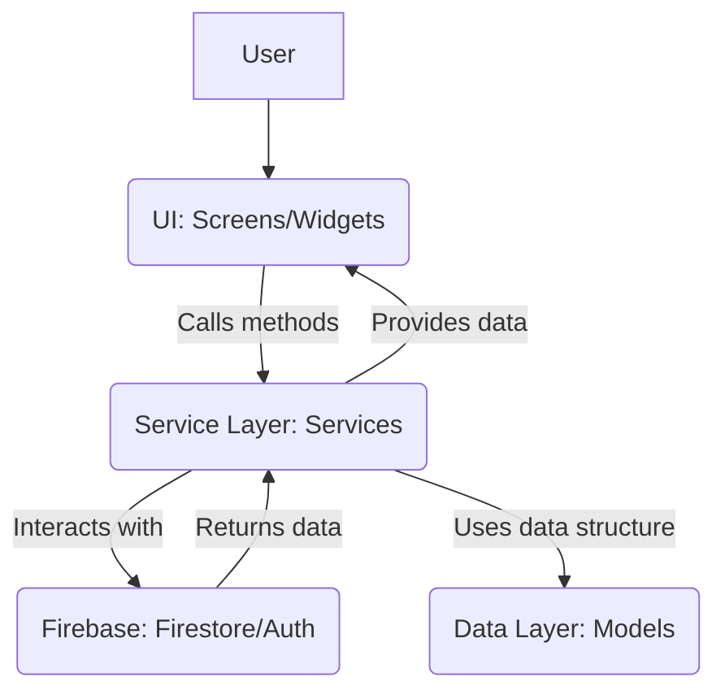

# プロジェクト構造レポート

## 全体アーキテクチャ

本プロジェクトは、Flutterアプリケーションであり、Firebase Firestoreをバックエンドとして利用しています。データ永続化にはFirestoreを使用し、認証にはFirebase Authenticationを採用しています。

アプリケーションのアー全体キテクチャは、**サービス層パターン**を採用しています。これは、UI（画面）から直接データベース操作を行わず、間に「サービス層」を挟むことで、UIとデータロジックの分離を図る設計です。

基本的なデータの流れは以下のようになります。

1.  **UI層 (Screens/Widgets)**: ユーザーからの入力（ボタンタップ、フォーム入力など）を受け付け、サービス層のメソッドを呼び出します。また、サービス層から提供されるデータを表示します。
2.  **サービス層 (Services)**: UI層からの要求を受け取り、Firebase FirestoreやFirebase Authenticationといった外部サービスとの通信を担います。データの取得、保存、更新、削除などのロジックをここに集約します。
3.  **データ層 (Models)**: アプリケーション内で扱うデータの構造を定義します。Firestoreとのデータのやり取り（`fromMap`, `toMap`）もモデル内で処理します。
4.  **Firebase (Backend)**: 実際のデータストレージと認証機能を提供します。



## ディレクトリ構造と各責務

`lib` ディレクトリ内の主要なディレクトリとその責務は以下の通りです。

```
lib/
├── constants/
│   ├── app_sizes.dart
│   └── app_theme.dart
├── models/
│   ├── learning_record.dart
│   └── study_plan.dart
├── screens/
│   ├── home/
│   │   └── home_screen.dart
│   ├── plan/
│   │   └── plan_list_screen.dart
│   ├── analysis_screen.dart
│   ├── learning_screen.dart
│   ├── login_screen.dart
│   ├── plan_creation_screen.dart
│   ├── plan_detail_screen.dart
│   ├── settings_screen.dart
│   └── signup_screen.dart
├── services/
│   ├── auth_service.dart
│   └── plan_service.dart
├── widgets/
│   ├── common/
│   │   ├── loading_indicator.dart
│   │   └── primary_button.dart
│   ├── app_logo.dart
│   ├── error_display.dart
│   ├── plan_card.dart
│   ├── pomodoro_timer.dart
│   └── secondary_button.dart
├── auth_gate.dart
├── firebase_options.dart
├── main_scaffold.dart
└── main.dart
```

-   **`constants/`**: アプリケーション全体で共通して使用される定数やテーマ定義を格納します。
    -   `app_sizes.dart`: パディング、マージン、角丸などのサイズに関する定数を定義します。
    -   `app_theme.dart`: アプリケーションのライトテーマとダークテーマのカラーパレット、テキストスタイルを定義します。
-   **`models/`**: アプリケーションのデータ構造を定義するクラスを格納します。
    -   `learning_record.dart`: 学習記録のデータモデル。
    -   `study_plan.dart`: 学習計画のデータモデル。
-   **`screens/`**: アプリケーションの各画面（ページ）を構成するウィジェットを格納します。
    -   `home/`: ホーム画面。
    -   `plan/`: 学習計画リスト画面。
    -   `analysis_screen.dart`: 学習分析画面。
    -   `learning_screen.dart`: 学習記録入力画面（現在は準備中）。
    -   `login_screen.dart`: ログイン画面。
    -   `plan_creation_screen.dart`: 学習計画作成・編集画面。
    -   `plan_detail_screen.dart`: 学習計画詳細画面。
    -   `settings_screen.dart`: 設定画面。
    -   `signup_screen.dart`: 新規登録画面。
-   **`services/`**: バックエンド（Firebase）との通信やビジネスロジックを担うサービス層のクラスを格納します。
    -   `auth_service.dart`: Firebase Authentication を使用した認証関連のロジック（サインアップ、ログイン、ログアウト、認証状態の監視）を扱います。
    -   `plan_service.dart`: Firebase Firestore を使用した学習計画と学習記録のデータ操作（取得、追加、更新、削除）を扱います。ユーザーごとのデータ分離もここで行われます。
-   **`widgets/`**: アプリケーション全体で再利用可能なUIコンポーネントを格納します。
    -   `common/`: 汎用的な共通ウィジェット。
        -   `loading_indicator.dart`: ローディング表示。
        -   `primary_button.dart`: 主要なアクションボタン。
    -   `app_logo.dart`: アプリケーションのロゴ。
    -   `error_display.dart`: エラーメッセージ表示。
    -   `plan_card.dart`: 学習計画のカードUI。
    -   `pomodoro_timer.dart`: ポモドーロタイマーウィジェット。
    -   `secondary_button.dart`: 二次的なアクションボタン。
-   **`auth_gate.dart`**: アプリケーションの認証状態に応じて、表示する画面を切り替える役割を担います。
-   **`firebase_options.dart`**: Firebaseプロジェクトの設定情報（`flutterfire configure` コマンドで自動生成）。
-   **`main_scaffold.dart`**: アプリケーションのメインのナビゲーション（BottomNavigationBar）と、各画面の切り替えを管理します。
-   **`main.dart`**: アプリケーションのエントリーポイント。Firebaseの初期化、テーマの適用、`AuthGate` の起動を行います。

## 認証フロー

アプリの起動からホーム画面表示までの認証フローは以下の通りです。

1.  **`main.dart`**:
    -   `WidgetsFlutterBinding.ensureInitialized()`: Flutterエンジンの初期化を保証します。
    -   `Firebase.initializeApp()`: Firebaseプロジェクトを初期化します。`firebase_options.dart` からプラットフォームごとの設定を読み込みます。
    -   `runApp(const MyApp())`: アプリケーションのルートウィジェットである `MyApp` を起動します。
2.  **`MyApp`**:
    -   `MaterialApp` を設定し、`AppTheme` からライトテーマとダークテーマを適用します。
    -   `home` プロパティに `AuthGate` を設定します。これにより、アプリの起動時にまず `AuthGate` が表示されます。
3.  **`AuthGate`**:
    -   `AuthService` の `authStateChanges` ストリームを監視します。このストリームは、Firebase Authentication の認証状態（ログイン済み、未ログインなど）の変化をリアルタイムで通知します。
    -   `StreamBuilder` を使用して、`authStateChanges` ストリームから受け取ったスナップショットに基づいて、表示するウィジェットを切り替えます。
        -   `snapshot.connectionState == ConnectionState.waiting`: 認証状態の確認中であれば、`CircularProgressIndicator` を表示します。
        -   `snapshot.hasData` (ユーザーがログイン済み): `MainScaffold` を表示します。
        -   `!snapshot.hasData` (ユーザーが未ログイン): `LoginScreen` を表示します。
4.  **`LoginScreen`**:
    -   ユーザーがメールアドレスとパスワードを入力し、「ログイン」ボタンをタップすると、`AuthService().logIn()` メソッドが呼び出されます。
    -   ログインに成功すると、`AuthService` の `authStateChanges` ストリームが更新され、`AuthGate` がそれを検知します。
5.  **`MainScaffold`**:
    -   ユーザーがログイン済みの場合に `AuthGate` から表示されます。
    -   `BottomNavigationBar` を提供し、`HomeScreen`、`AnalysisScreen`、`SettingsScreen` などの主要な画面を切り替えることができます。
    -   `HomeScreen` は、ログインしているユーザーの学習計画を表示します。

このフローにより、ユーザーはアプリ起動時に自動的に認証状態がチェックされ、必要に応じてログイン画面に誘導されるか、直接メインコンテンツにアクセスできるようになっています。
